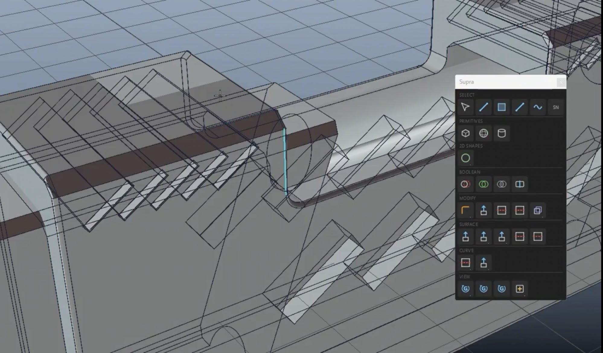

  

# Supra Modeler

NURBS/BRep direct modeling for Maya 2025 and 2026.
Built on OpenCASCADE.

[Download latest](https://github.com/ytsejam/supra-modeler/releases/latest)

**SHA256 (Maya 2026 zip download):** `63d0f4c12c29d6c91c2e3b7b79bf4a834351b01f198c5842af6d236f972b764a`

**SHA256 (Maya 2026 MSD_Supra_Modeler.mll, signed):** `16a84ff249e1bc082079f96006aaaee9fd46b3ef1ec5c542a541f12ecd649485`  
[Verify on VirusTotal](https://www.virustotal.com/gui/file/16a84ff249e1bc082079f96006aaaee9fd46b3ef1ec5c542a541f12ecd649485)

**SHA256 (Maya 2025 zip download):** `4b6b062e4271a03e5429a177e80513f106aff35c6fca964b3ddf3bae1d4bf8d6`

**SHA256 (Maya 2025 MSD_Supra_Modeler.mll, signed):** `b63fe457a4f59df1553c0a880531251f64881d53d5bea40e177538e7c3883d53`  
[Verify on VirusTotal](https://www.virustotal.com/gui/file/b63fe457a4f59df1553c0a880531251f64881d53d5bea40e177538e7c3883d53)

**Requirements:** Maya 2025 or 2026 · Windows 10/11 x64

**Install:**
1. Unzip the package matching your Maya version, keeping all files together
2. In Maya: Script Editor > File > Source Script... > install_supra.py
3. Click the new "Supra" shelf button

**Feedback:** info@msd-suite.com

**Discord:** https://discord.gg/ZKrj3WrBs

---

## LGPL Compliance

Supra Modeler uses OCCT statically linked under LGPL 2.1.
Object files for relinking are in lgpl_compliance/

---

## License

Supra Modeler is proprietary software. Free during beta.
See LICENSE.md.

---

Made by Dario Ortisi — https://msd-suite.com