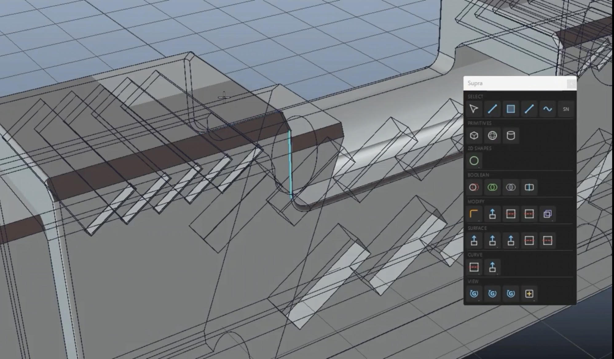

  

# Supra Modeler

NURBS/BRep direct modeling for Maya 2025 and 2026.
Built on OpenCASCADE.

[Download latest](https://github.com/ytsejam/supra-modeler/releases/latest)

**SHA256 (Maya 2026 zip download):** `2db23ee24340c19aee97aa4f38eaf1a6f938b35dac3d4c068217fe3174ef47db`

**SHA256 (Maya 2026 MSD_Supra_Modeler.mll, signed):** `0a15f340b006d665e8fd4d06df643ec6423c41c27c89ca475ff2c15f5eb5998e`  
[Verify on VirusTotal](https://www.virustotal.com/gui/file/0a15f340b006d665e8fd4d06df643ec6423c41c27c89ca475ff2c15f5eb5998e)

**SHA256 (Maya 2025 zip download):** `21c81433763ccea0b90ce268cdfb7032235bcdcccab43e6207b313f578fe05b5`

**SHA256 (Maya 2025 MSD_Supra_Modeler.mll, signed):** `afbfb70051219b5e1873035563cddc7570775ffa7e6770c4a2729876b74f427d`  
[Verify on VirusTotal](https://www.virustotal.com/gui/file/afbfb70051219b5e1873035563cddc7570775ffa7e6770c4a2729876b74f427d)

**Requirements:** Maya 2025 or 2026 · Windows 10/11 x64

**Install:**
1. Unzip the package matching your Maya version, keeping all files together
2. In Maya: Script Editor > File > Source Script... > install_supra.py
3. Click the new "Supra" shelf button

**Feedback:** info@msd-suite.com

**Discord:** https://discord.gg/ZKrj3WrBs

---

## LGPL Compliance

Supra Modeler uses OCCT statically linked under LGPL 2.1.
Object files for relinking are in lgpl_compliance/

---

## License

Supra Modeler is proprietary software. Free during beta.
See LICENSE.md.

---

Made by Dario Ortisi — https://msd-suite.com